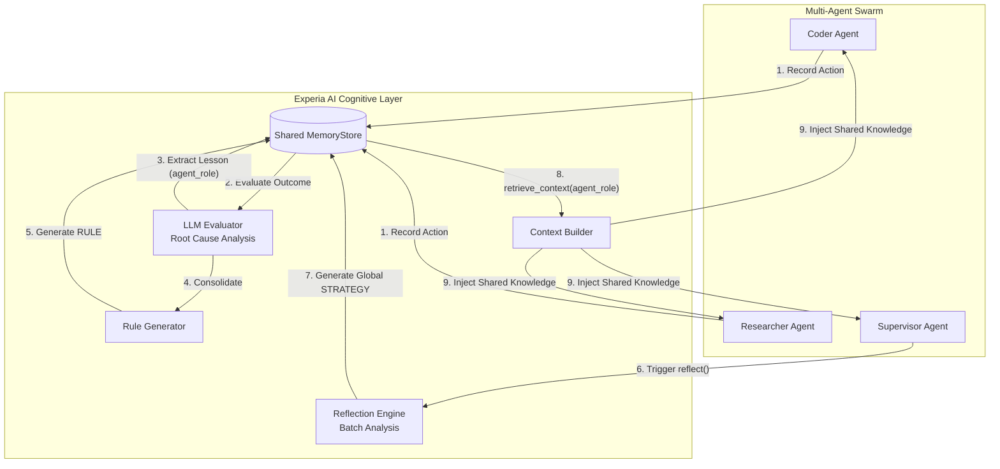

# Experia AI

[](https://badge.fury.io/py/experia)
[](https://www.python.org/downloads/)
[](https://opensource.org/licenses/MIT)

### Memory layers help your agents *remember*. Experia helps them *learn*.

The open-source **experience-learning layer** that makes AI agents measurably
stop repeating their mistakes. Experia captures what an agent did, evaluates why
it worked or failed, distills a reusable lesson, and reinforces the strategies
that keep paying off — a cognitive plugin for the frameworks you already use
(LangChain, LangGraph, and more). It doesn't replace your agent framework; it
closes the feedback loop around it.

## Vision

Current AI agents start from zero on every interaction. Experia adds an **experience learning loop** around agents. It allows agents to remember what happened, understand why it worked or failed, and improve future decisions.

**Observation → Action → Result → Experience → Lesson → Memory → Better Future Action**



## Does it actually work?

A deterministic, fully offline benchmark ([`benchmark/learning_benchmark.py`](benchmark/learning_benchmark.py))
pits two identical agents against the same workday of ops tasks. The agent has
**no built-in knowledge** — its only intelligence is the context Experia injects,
so every difference is attributable to the cognitive layer.

```text illustrative
Experia learning benchmark  (6 tasks x 4 rounds = 24 episodes)
==================================================================
Metric                                  Baseline       Experia
------------------------------------------------------------------
Tasks completed successfully               0/24         18/24
Overall success rate                          0%           75%
Mistakes repeated (avoidable)                 18             0
==================================================================

Success rate per round (the learning curve)
------------------------------------------------------------------
  Round 1   baseline [....................]   0%   experia [....................]   0%
  Round 2   baseline [....................]   0%   experia [####################] 100%
  Round 3   baseline [....................]   0%   experia [####################] 100%
  Round 4   baseline [....................]   0%   experia [####################] 100%
------------------------------------------------------------------
```

The baseline agent makes the same avoidable mistake **18 times**. The Experia
agent fails each task at most once, extracts the lesson, and never repeats it —
reaching a 100% success rate from the second encounter on. No LLM or API key is
required to reproduce this:

```bash illustrative
python benchmark/learning_benchmark.py
```

## Integrations

Experia acts as a cognitive plugin. It does not replace your agent frameworks (like LangChain, AutoGen, CrewAI), it enhances them by managing long-term memory, learned experiences, user knowledge, and behavioral patterns.

## Getting Started

Install the base package for the offline core quickstart:

```bash illustrative
pip install experia
```

Optional features have separate extras: `experia[llm]` for LiteLLM-backed
evaluation/embedding/rules/reflection, `experia[langchain]` for LangChain, and
`experia[langgraph]` for LangGraph. Provider credentials are needed only when
the selected LLM or embedding provider requires them.

For class and method details, see the [API Reference](API_REFERENCE.md).

### Offline quickstart

This is the canonical executable quickstart from
[`examples/quickstart.py`](examples/quickstart.py). It needs no network access,
credentials, or optional extra, and its assertions document the installed
`ExperienceRecord` and `Memory` behavior.

<!-- BEGIN EXECUTABLE QUICKSTART -->
```python executable
"""Executable, offline Experia quickstart using only the base installation."""

import asyncio

from experia import Learner, MemoryType, SimpleHeuristicEvaluator, SQLiteStore


async def main() -> None:
    store = SQLiteStore(":memory:")
    await store.initialize()
    try:
        learner = Learner(
            store=store,
            evaluator=SimpleHeuristicEvaluator(),
        )

        experience = await learner.record(
            task="Deploy web app",
            action="Restart Nginx",
            result="failed with config syntax error",
            context={"attempt": 1},
        )
        assert experience.task == "Deploy web app"
        assert experience.action == "Restart Nginx"
        assert experience.result == "failed with config syntax error"
        assert experience.context == {"attempt": 1}

        persisted = await store.get_experience(experience.id)
        assert persisted is not None
        assert persisted.model_dump() == experience.model_dump()

        await learner.flush()
        memories = await store.search_memories(memory_type=MemoryType.LESSON)
        assert len(memories) == 1
        lesson_memory = memories[0]
        assert lesson_memory.type is MemoryType.LESSON
        assert lesson_memory.agent_role == "default"
        assert lesson_memory.confidence == 0.6
        assert lesson_memory.source == f"experience_{experience.id}"
        assert "Restart Nginx" in lesson_memory.content

        reinforced = await learner.reinforce(lesson_memory.id, success=True)
        assert reinforced is not None
        assert reinforced.reinforcement_count == 1
        assert reinforced.success_count == 1
        assert reinforced.confidence == 0.68
    finally:
        await store.close()


if __name__ == "__main__":
    asyncio.run(main())
```
<!-- END EXECUTABLE QUICKSTART -->

Run the same checked source with:

```bash illustrative
python examples/quickstart.py
```

`Learner` always requires both `store` and `evaluator`; the quickstart uses the
base-package `SimpleHeuristicEvaluator`. Network-backed calls are kept out of the offline quickstart. The installed
constructor examples below exercise each optional import without making network
requests; the API gate runs each script in an environment containing only its
declared extra.

- LLM evaluation, embeddings, and rules: `experia.experience.llm_evaluator.LLMEvaluator`,
  `experia.LiteLLMEmbedder`, and `experia.improvement.rules.RuleGenerator` with
  `experia[llm]` ([example](examples/llm_extra.py)).
- LangChain callbacks/retrieval: `experia.integrations.langchain.callbacks.ExperiaCallbackHandler`
  and `experia.integrations.langchain.retrievers.ExperiaLearningRetriever` with
  `experia[langchain]` ([example](examples/langchain_extra.py)).
- LangGraph nodes: `experia.integrations.langgraph.nodes.ExperiaContextNode` and
  `experia.integrations.langgraph.nodes.ExperiaLearningNode` with
  `experia[langgraph]` ([example](examples/langgraph_extra.py)).

The exact example-to-extra mapping is machine-readable in
[`examples/installed-examples.json`](examples/installed-examples.json).

## Project Status

**Implemented today**

Each implemented entry links to an executable example or automated executable
test that exercises the installed behavior.

| Capability | Executable evidence |
|---|---|
| Core experience → lesson → memory loop, SQLite persistence, background `flush()`, and confidence reinforcement | [offline quickstart](examples/quickstart.py) · [automated quickstart test](tests/test_documentation.py) |
| Pluggable embedder, semantic retrieval, keyword fallback, de-duplication, and expiry | [learner scenarios](tests/test_learner.py) · [store scenarios](tests/test_store.py) |
| LLM evaluator, rule generation, and reflection | [LLM/rule executable tests](tests/test_llm.py) · [reflection executable test](tests/test_reflection.py) |
| LangChain callback integration | [end-to-end callback example/test](tests/integrations/test_experience_flow.py) |
| LangGraph context and learning nodes | [node example/test](tests/integrations/test_langgraph_nodes.py) |

**Planned (unavailable in the current version)**

The following roadmap items are not implemented in version 0.8.0 and are not
used by any quickstart. Existing placeholder imports fail explicitly with
`UnavailableFeatureError` rather than presenting an operational backend. Each
item's owner/team/`unassigned` status and readiness are tracked in the
machine-validated [`roadmap-ownership.yml`](roadmap-ownership.yml) manifest:

<!-- BEGIN GENERATED ROADMAP STATUS -->
- **AutoGen native integration** (integration) — readiness `planned`, ownership `unassigned`; no importable placeholder yet.
- **CrewAI native integration** (integration) — readiness `planned`, ownership `unassigned`; placeholder `experia.integrations.crewai.CrewAIIntegration` raises `UnavailableFeatureError`.
- **Distributed production mode (Redis-backed queue + workers)** (runtime) — readiness `planned`, ownership `unassigned`; no importable placeholder yet.
- **Mem0 memory adapter** (adapter) — readiness `planned`, ownership `unassigned`; placeholder `experia.adapters.mem0.Mem0Adapter` raises `UnavailableFeatureError`.
- **OpenAI Agents native integration** (integration) — readiness `planned`, ownership `unassigned`; no importable placeholder yet.
- **PostgreSQL + `pgvector` store** (adapter) — readiness `planned`, ownership `unassigned`; placeholder `experia.adapters.postgres.PostgresAdapter` raises `UnavailableFeatureError`.
- **Zep memory adapter** (adapter) — readiness `planned`, ownership `unassigned`; placeholder `experia.adapters.zep.ZepAdapter` raises `UnavailableFeatureError`.
<!-- END GENERATED ROADMAP STATUS -->

Contributions toward these are welcome — see [CONTRIBUTING.md](CONTRIBUTING.md).

## License

This project is licensed under the MIT License. See the [LICENSE](LICENSE) file for details.
