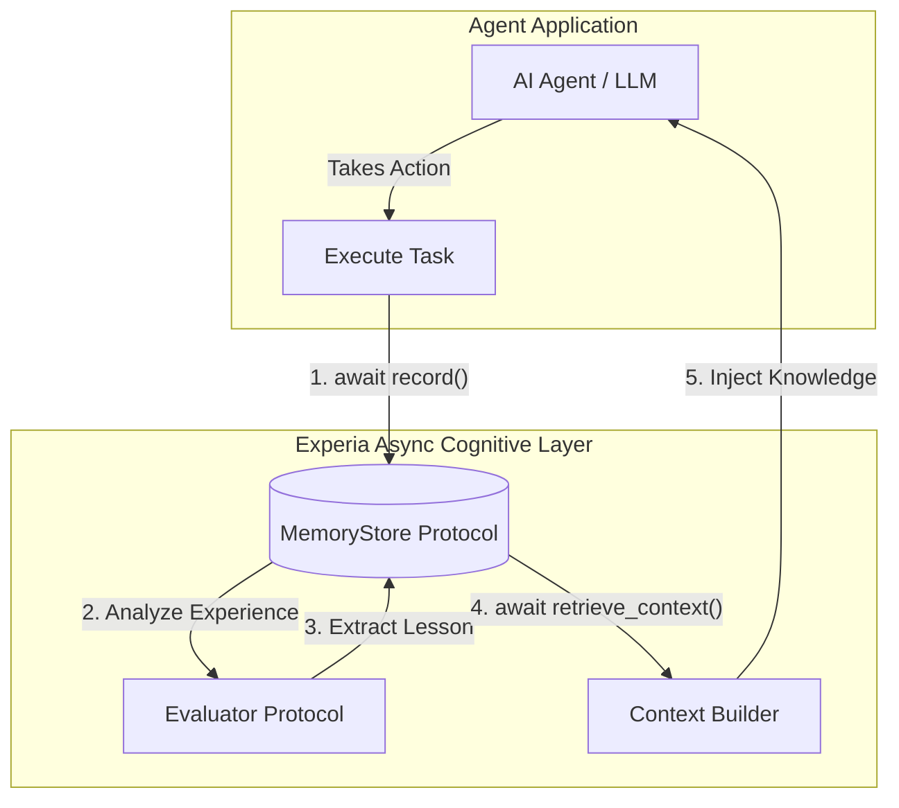

# Experia AI

The open-source experience learning layer for AI agents.

Experia enables agents to learn from past actions, failures, and outcomes.
It provides experience capture, lesson extraction, behavioral improvement,
and long-term cognitive memory without replacing existing agent frameworks.

## Vision

Current AI agents start from zero on every interaction. Experia adds an **experience learning loop** around agents. It allows agents to remember what happened, understand why it worked or failed, and improve future decisions.

**Observation → Action → Result → Experience → Lesson → Memory → Better Future Action**



## Integrations

Experia acts as a cognitive plugin. It does not replace your agent frameworks (like LangChain, AutoGen, CrewAI), it enhances them by managing long-term memory, learned experiences, user knowledge, and behavioral patterns.

## Getting Started

Experia uses an **asynchronous** and **pluggable** architecture.

```bash
pip install experia
```

```python
import asyncio
from experia.core.learner import Learner
from experia.memory.store import SQLiteStore
from experia.experience.evaluator import SimpleHeuristicEvaluator

async def main():
    # 1. Dependency Injection setup
    store = SQLiteStore("my_agent.db")
    await store.initialize()
    
    evaluator = SimpleHeuristicEvaluator()
    
    # 2. Initialize Learner
    agent = Learner(store=store, evaluator=evaluator)

    # 3. Use the async API to record actions
    await agent.record(
        task="Deploy web app",
        action="Restart Nginx",
        result="failed with config syntax error"
    )

    # 4. Retrieve memory context for your LLM
    context = await agent.retrieve_context()
    print(context)

if __name__ == "__main__":
    asyncio.run(main())
```

## License

This project is licensed under the MIT License. See the [LICENSE](LICENSE) file for details.
