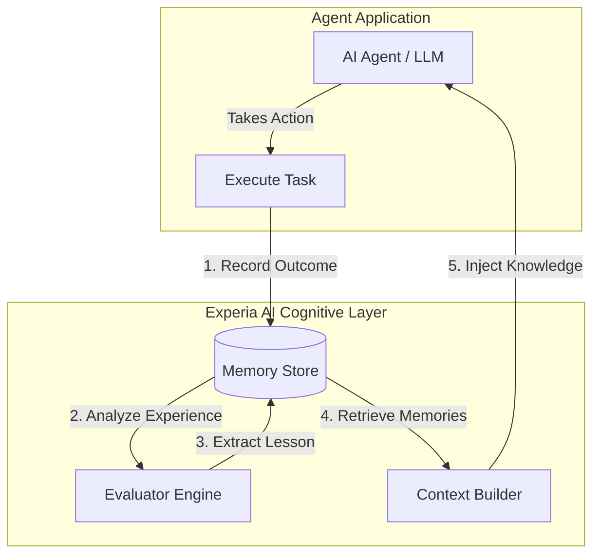

# Experia AI

The open-source experience learning layer for AI agents.

Experia enables agents to learn from past actions, failures, and outcomes.
It provides experience capture, lesson extraction, behavioral improvement,
and long-term cognitive memory without replacing existing agent frameworks.

## Vision

Current AI agents start from zero on every interaction. Experia adds an **experience learning loop** around agents. It allows agents to remember what happened, understand why it worked or failed, and improve future decisions.

**Observation → Action → Result → Experience → Lesson → Memory → Better Future Action**

## Integrations

Experia acts as a cognitive plugin. It does not replace your agent frameworks (like LangChain, AutoGen, CrewAI), it enhances them by managing long-term memory, learned experiences, user knowledge, and behavioral patterns.

## Getting Started

*(Installation and usage instructions coming soon...)*

## License

This project is licensed under the MIT License. See the [LICENSE](LICENSE) file for details.
