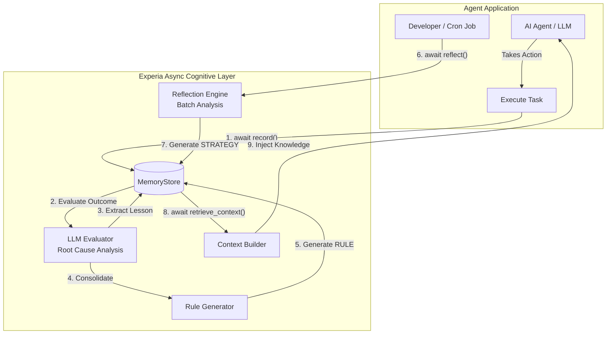

# Experia AI

[](https://badge.fury.io/py/experia)
[](https://www.python.org/downloads/)
[](https://opensource.org/licenses/MIT)

The open-source experience learning layer for AI agents.

Experia enables agents to learn from past actions, failures, and outcomes.
It provides experience capture, lesson extraction, behavioral improvement,
and long-term cognitive memory without replacing existing agent frameworks.

## Vision

Current AI agents start from zero on every interaction. Experia adds an **experience learning loop** around agents. It allows agents to remember what happened, understand why it worked or failed, and improve future decisions.

**Observation → Action → Result → Experience → Lesson → Memory → Better Future Action**



## Integrations

Experia acts as a cognitive plugin. It does not replace your agent frameworks (like LangChain, AutoGen, CrewAI), it enhances them by managing long-term memory, learned experiences, user knowledge, and behavioral patterns.

## Getting Started

Experia uses an **asynchronous** and **pluggable** architecture. To use the advanced cognitive features (Root Cause Analysis, Rules, and Reflection), install with the `llm` extra. You can also install specific integration extras like `langchain`, `langgraph`, or `openai`:

```bash
pip install "experia[llm,langgraph]"
```

*Note: You will need an `OPENAI_API_KEY` (or other litellm supported keys) exported in your environment.*

### Native LangGraph Integration

Experia provides native, stateful Nodes for **LangGraph**, the modern standard for Multi-Agent and Cyclical AI workflows.

```python
import asyncio
from experia.core.learner import Learner
from experia.memory.store import SQLiteStore
from experia.experience.llm_evaluator import LLMEvaluator
from experia.integrations.langgraph.nodes import ExperiaContextNode, ExperiaLearningNode
from langgraph.graph import StateGraph, MessagesState


async def main():
    store = SQLiteStore("my_agent.db")
    await store.initialize()
    agent = Learner(store=store, evaluator=LLMEvaluator(model="gpt-4o-mini"))

    # Define your standard LangGraph
    builder = StateGraph(MessagesState)

    # 1. Add Experia Context Node (Injects learned knowledge before the agent acts)
    builder.add_node("inject_context", ExperiaContextNode(agent=agent))

    # 2. Add your Agent and Tool nodes
    # builder.add_node("agent", ...)
    # builder.add_node("tools", ...)

    # 3. Add Experia Learning Node (Extracts experiences after tools run)
    builder.add_node("learn", ExperiaLearningNode(agent=agent))

    # Flow
    builder.set_entry_point("inject_context")
    # builder.add_edge("inject_context", "agent")
    # builder.add_edge("agent", "tools")
    # builder.add_edge("tools", "learn")
    # builder.add_edge("learn", "agent")

    graph = builder.compile()

    # Now run your graph! Experia will automatically learn from every cycle.
    # await graph.ainvoke({"messages": [...]})


if __name__ == "__main__":
    asyncio.run(main())
```

### Manual Core API

You can also use the core API manually without any frameworks:

```python
import asyncio
from experia.core.learner import Learner
from experia.memory.store import SQLiteStore
from experia.experience.llm_evaluator import LLMEvaluator
from experia.improvement.rules import RuleGenerator


async def main():
    store = SQLiteStore("my_agent.db")
    await store.initialize()

    agent = Learner(
        store=store,
        evaluator=LLMEvaluator(model="gpt-4o-mini"),
        rule_generator=RuleGenerator(store=store, model="gpt-4o-mini"),
    )

    # Record actions explicitly
    await agent.record(
        task="Deploy web app",
        action="Restart Nginx",
        result="failed with config syntax error",
    )

    # Developer-controlled Nightly Reflection
    await agent.reflect(model="gpt-4o-mini", batch_size=50)


if __name__ == "__main__":
    asyncio.run(main())
```

## License

This project is licensed under the MIT License. See the [LICENSE](LICENSE) file for details.
