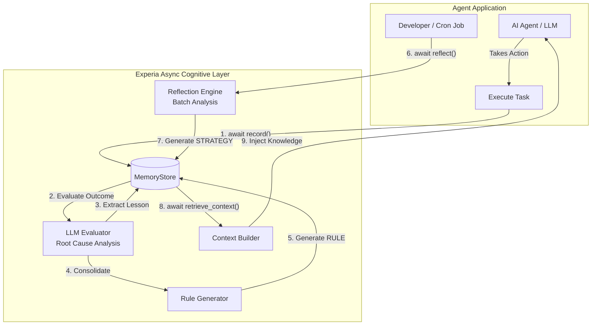

# Experia AI

[](https://badge.fury.io/py/experia)
[](https://www.python.org/downloads/)
[](https://opensource.org/licenses/MIT)

The open-source experience learning layer for AI agents.

Experia enables agents to learn from past actions, failures, and outcomes.
It provides experience capture, lesson extraction, behavioral improvement,
and long-term cognitive memory without replacing existing agent frameworks.

## Vision

Current AI agents start from zero on every interaction. Experia adds an **experience learning loop** around agents. It allows agents to remember what happened, understand why it worked or failed, and improve future decisions.

**Observation → Action → Result → Experience → Lesson → Memory → Better Future Action**



## Integrations

Experia acts as a cognitive plugin. It does not replace your agent frameworks (like LangChain, AutoGen, CrewAI), it enhances them by managing long-term memory, learned experiences, user knowledge, and behavioral patterns.

## Getting Started

Experia uses an **asynchronous** and **pluggable** architecture. To use the advanced cognitive features (Root Cause Analysis, Rules, and Reflection), install with the `llm` extra. You can also install specific integration extras like `langchain`, `langgraph`, or `openai`:

```bash
pip install "experia[llm,langchain]"
```

*Note: You will need an `OPENAI_API_KEY` (or other litellm supported keys) exported in your environment.*

### LangChain Integration

Experia provides native integrations for LangChain, allowing you to inject cognitive learning into existing agents without changing their core logic.

```python
import asyncio
from experia.core.learner import Learner
from experia.memory.store import SQLiteStore
from experia.experience.llm_evaluator import LLMEvaluator
from experia.integrations.langchain.callbacks import ExperiaCallbackHandler
from experia.integrations.langchain.retrievers import ExperiaLearningRetriever
from langchain.agents import initialize_agent, AgentType
from langchain.llms import OpenAI
from langchain.tools import Tool

async def main():
    store = SQLiteStore("my_agent.db")
    await store.initialize()
    agent = Learner(store=store, evaluator=LLMEvaluator(model="gpt-4o-mini"))

    # 1. Native Experia Callback Handler
    # Automatically listens to LangChain events, builds cohesive experiences, and records them.
    experia_callback = ExperiaCallbackHandler(agent=agent)
    
    # 2. Native Learning Retriever
    # Plugs into LCEL chains to automatically fetch past lessons and rules.
    learning_retriever = ExperiaLearningRetriever(agent=agent)

    # Initialize your standard LangChain agent
    llm = OpenAI(temperature=0)
    tools = [Tool(name="ExampleTool", func=lambda x: "Success", description="Example")]
    
    lc_agent = initialize_agent(tools, llm, agent=AgentType.ZERO_SHOT_REACT_DESCRIPTION)
    
    # Run the agent with the Experia callback!
    await lc_agent.arun("Deploy the application", callbacks=[experia_callback])

if __name__ == "__main__":
    asyncio.run(main())
```

### Manual Core Usage

You can also use the core API manually:

```python
import asyncio
from experia.core.learner import Learner
from experia.memory.store import SQLiteStore
from experia.experience.llm_evaluator import LLMEvaluator
from experia.improvement.rules import RuleGenerator


async def main():
    # 1. Dependency Injection setup
    store = SQLiteStore("my_agent.db")
    await store.initialize()

    # 2. Advanced LLM Cognition
    evaluator = LLMEvaluator(model="gpt-4o-mini")
    rule_generator = RuleGenerator(store=store, model="gpt-4o-mini")
    
    agent = Learner(store=store, evaluator=evaluator, rule_generator=rule_generator)

    # 3. Use the async API to record actions (Evaluates and generates rules automatically)
    await agent.record(
        task="Deploy web app",
        action="Restart Nginx",
        result="failed with config syntax error",
    )

    # 4. Retrieve memory context for your LLM's next action
    context = await agent.retrieve_context()
    print(context)

    # 5. Nightly/Scheduled Reflection
    # Analyzes the last N experiences to find patterns and extract global strategies.
    # Developer-controlled to manage AI reasoning costs.
    await agent.reflect(model="gpt-4o-mini", batch_size=50)


if __name__ == "__main__":
    asyncio.run(main())
```

## License

This project is licensed under the MIT License. See the [LICENSE](LICENSE) file for details.
