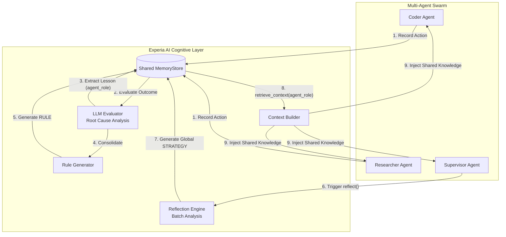

# Experia AI

[](https://badge.fury.io/py/experia)
[](https://www.python.org/downloads/)
[](https://opensource.org/licenses/MIT)

### Memory layers help your agents *remember*. Experia helps them *learn*.

The open-source **experience-learning layer** that makes AI agents measurably
stop repeating their mistakes. Experia captures what an agent did, evaluates why
it worked or failed, distills a reusable lesson, and reinforces the strategies
that keep paying off — a cognitive plugin for the frameworks you already use
(LangChain, LangGraph, and more). It doesn't replace your agent framework; it
closes the feedback loop around it.

## Vision

Current AI agents start from zero on every interaction. Experia adds an **experience learning loop** around agents. It allows agents to remember what happened, understand why it worked or failed, and improve future decisions.

**Observation → Action → Result → Experience → Lesson → Memory → Better Future Action**



## Does it actually work?

A deterministic, fully offline benchmark ([`benchmark/learning_benchmark.py`](benchmark/learning_benchmark.py))
pits two identical agents against the same workday of ops tasks. The agent has
**no built-in knowledge** — its only intelligence is the context Experia injects,
so every difference is attributable to the cognitive layer.

```text
Experia learning benchmark  (6 tasks x 4 rounds = 24 episodes)
==================================================================
Metric                                  Baseline       Experia
------------------------------------------------------------------
Tasks completed successfully               0/24         18/24
Overall success rate                          0%           75%
Mistakes repeated (avoidable)                 18             0
==================================================================

Success rate per round (the learning curve)
------------------------------------------------------------------
  Round 1   baseline [....................]   0%   experia [....................]   0%
  Round 2   baseline [....................]   0%   experia [####################] 100%
  Round 3   baseline [....................]   0%   experia [####################] 100%
  Round 4   baseline [....................]   0%   experia [####################] 100%
------------------------------------------------------------------
```

The baseline agent makes the same avoidable mistake **18 times**. The Experia
agent fails each task at most once, extracts the lesson, and never repeats it —
reaching a 100% success rate from the second encounter on. No LLM or API key is
required to reproduce this:

```bash
python benchmark/learning_benchmark.py
```

## Integrations

Experia acts as a cognitive plugin. It does not replace your agent frameworks (like LangChain, AutoGen, CrewAI), it enhances them by managing long-term memory, learned experiences, user knowledge, and behavioral patterns.

## Getting Started

Experia uses an **asynchronous** and **pluggable** architecture. To use the advanced cognitive features (Root Cause Analysis, Rules, and Reflection), install with the `llm` extra. You can also install specific integration extras like `langchain`, `langgraph`, or `openai`:

```bash
pip install "experia[llm,langgraph]"
```

*Note: You will need an `OPENAI_API_KEY` (or other litellm supported keys) exported in your environment.*

For full documentation on classes, methods, and models, please see the [API Reference](API_REFERENCE.md).

### Native LangGraph Integration

Experia provides native, stateful Nodes for **LangGraph**, the modern standard for Multi-Agent and Cyclical AI workflows.

```python
import asyncio
from experia.core.learner import Learner
from experia.memory.store import SQLiteStore
from experia.experience.llm_evaluator import LLMEvaluator
from experia.integrations.langgraph.nodes import ExperiaContextNode, ExperiaLearningNode
from langgraph.graph import StateGraph, MessagesState


async def main():
    store = SQLiteStore("my_agent.db")
    await store.initialize()
    agent = Learner(store=store, evaluator=LLMEvaluator(model="gpt-4o-mini"))

    # Define your standard LangGraph
    builder = StateGraph(MessagesState)

    # 1. Add Experia Context Node (Injects learned knowledge before the agent acts)
    builder.add_node("inject_context", ExperiaContextNode(agent=agent))

    # 2. Add your Agent and Tool nodes
    # builder.add_node("agent", ...)
    # builder.add_node("tools", ...)

    # 3. Add Experia Learning Node (Extracts experiences after tools run)
    builder.add_node("learn", ExperiaLearningNode(agent=agent))

    # Flow
    builder.set_entry_point("inject_context")
    # builder.add_edge("inject_context", "agent")
    # builder.add_edge("agent", "tools")
    # builder.add_edge("tools", "learn")
    # builder.add_edge("learn", "agent")

    graph = builder.compile()

    # Now run your graph! Experia will automatically learn from every cycle.
    # await graph.ainvoke({"messages": [...]})


if __name__ == "__main__":
    asyncio.run(main())
```

### Manual Core API

You can also use the core API manually without any frameworks:

```python
import asyncio
from experia.core.learner import Learner
from experia.memory.store import SQLiteStore
from experia.experience.llm_evaluator import LLMEvaluator
from experia.improvement.rules import RuleGenerator


async def main():
    store = SQLiteStore("my_agent.db")
    await store.initialize()

    agent = Learner(
        store=store,
        evaluator=LLMEvaluator(model="gpt-4o-mini"),
        rule_generator=RuleGenerator(store=store, model="gpt-4o-mini"),
    )

    # Record actions explicitly
    await agent.record(
        task="Deploy web app",
        action="Restart Nginx",
        result="failed with config syntax error",
    )

    # Developer-controlled Nightly Reflection
    await agent.reflect(model="gpt-4o-mini", batch_size=50)


if __name__ == "__main__":
    asyncio.run(main())
```

### Semantic Retrieval & the Feedback Loop

Retrieval is semantic when you attach an `Embedder`. Experia embeds memories on
write, ranks them by cosine similarity (blended with importance) on read, and
transparently falls back to keyword search when no embedder is configured — so
local mode stays dependency-light.

```python
from experia.memory.embeddings import LiteLLMEmbedder

agent = Learner(
    store=store,
    evaluator=LLMEvaluator(model="gpt-4o-mini"),
    embedder=LiteLLMEmbedder(model="text-embedding-3-small"),  # optional
)

# Capture is non-blocking: the raw experience is saved immediately and the
# (expensive) evaluation runs in the background.
await agent.record(task="Deploy web app", action="Restart Nginx", result="failed")
await agent.flush()  # await pending background evaluations when you need them

# Close the loop: tell Experia whether applying a memory actually helped.
# Confidence moves toward 1.0 on success, 0.0 on failure.
await agent.reinforce(memory_id, success=True)

# Housekeeping: sweep expired memories.
await agent.prune()
```

Near-duplicate lessons are de-duplicated on write (the existing memory is
reinforced instead of storing a copy).

## Project Status

**Implemented today**

- Core experience → lesson → memory loop (`Learner`)
- `SQLiteStore` with a reused connection, indexes, and atomic lesson+memory writes
- Pluggable `Embedder` + semantic retrieval (keyword fallback)
- Background (non-blocking) evaluation with `flush()`
- Confidence reinforcement (`reinforce`), memory de-duplication, and expiry (`prune`)
- LLM evaluator, rule generation, reflection engine
- LangChain & LangGraph integrations

**Planned (not yet implemented)**

The following backends are on the roadmap and are currently placeholder modules —
they are **not** production-ready yet:

- PostgreSQL + `pgvector` store
- Mem0 and Zep memory adapters
- CrewAI / OpenAI Agents / AutoGen native integrations
- Distributed production mode (Redis-backed queue + workers)

Contributions toward these are welcome — see [CONTRIBUTING.md](CONTRIBUTING.md).

## License

This project is licensed under the MIT License. See the [LICENSE](LICENSE) file for details.
